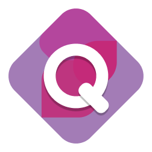

# Quirk 

Quirk is a statically-typed programming language designed for simplicity, performance, and safety. It features strong typing, structural method matching, and automatic memory management while allowing developers to manage memory explicitly when needed.

## Features

- Strong Typing: Supports signed/unsigned integers, floats, strings, chars, and booleans.
- Immutable and Mutable Variables: immut keyword for immutability.
- Memory Management:
    - Automatic deallocation for heap-allocated memory.
    - Explicit free() for manual deallocation.
- Error Handling: Functions return {ok: T | err: string} for structured error management.
- Asynchronous Functions: async fn for concurrency support.
- Structured Data:
    - Classes (no inheritance, construct method for initialization).
    - Structs & Enums for better data organization.
- Control Flow: if, else, for, while.
- Output: out("{}", variable) for formatted console printing.
- Interchangeable Types: Structural method matching ensures flexibility without explicit interfaces.

## Future Plans
- Add a low-level memory management module.
- Expand standard library support.

## Contributing
Contributions are welcome! Feel free to open issues and pull requests.
## Authors

- [@Lum1n0sity](https://www.github.com/Lum1n0sity)

